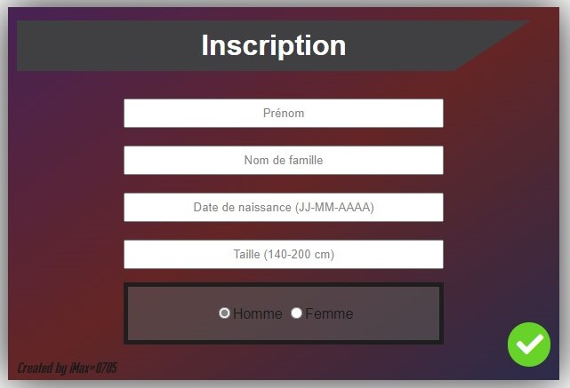

# Addon-design-esx-identity

111111111111111111111111111111111111111111111111111111111111111111111111111111111
111110000000001111000001111111000001111000000000000011110001111111111111110001111
111111110001111111000110011100110001111000111111100011111110001111111110001111111
111111110001111111000111100111110001111000111111100011111111110001110001111111111
111111110001111111000111111111110001111000000000000011111111111110001111111111111
111111110001111111000111111111110001111000111111100011111111110001110001111111111
111111110001111111000111111111110001111000111111100011111110001111111110001111111
111110000000001111000111111111110001111000111111100011110001111111111111110001111
111111111111111111111111111111111111111111111111111111111111111111111111111111111
 
 
## Contenu

 Script : Modification du HTML du script [esx_identity](github.com/esx-framework/esx_identity) crée par ESX Framework
 
 Version  : 1.0
 
 Langue   : HTML/CSS/JS/LUA
 
## Image(s)

## Crée par iMax 

 Discord : iMax#0705 | iMax²#9226
 
 Steam : iMax
